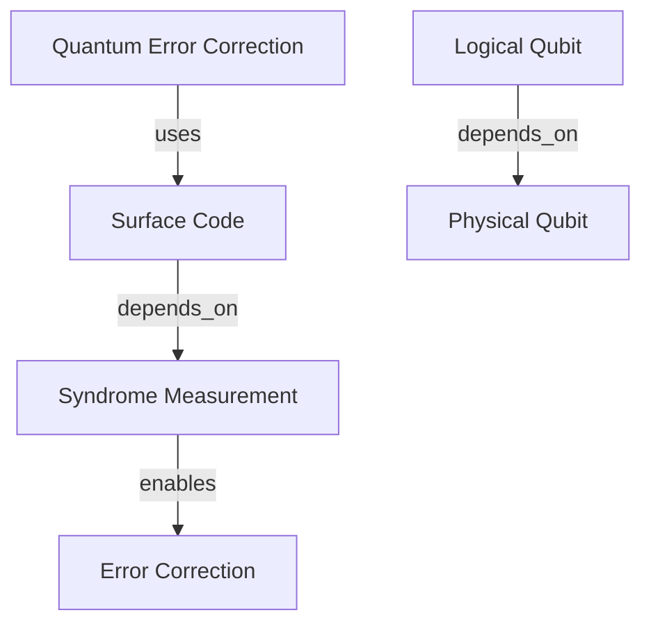
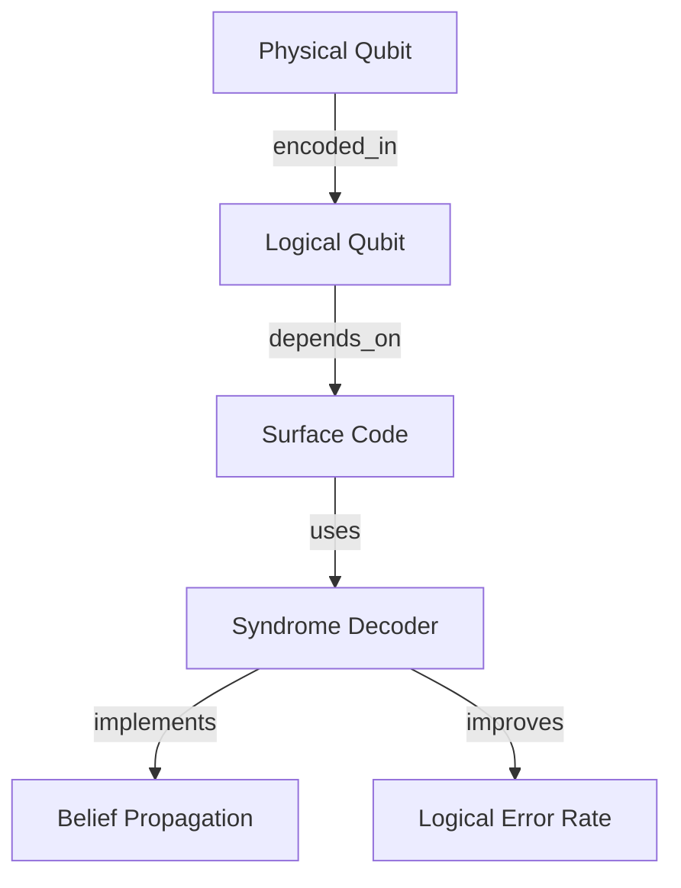

# PaperHunterAgent — QuantumResearchChain

> **Automatically discover, summarize, and visually map the latest quantum science papers from arXiv and Semantic Scholar — so you can spend less time searching and more time doing research.**

[](https://github.com/madara88645/PaperHunterAgent/actions/workflows/ci.yml)
[](https://www.python.org/downloads/)
[](LICENSE)

---

## ✨ Why PaperHunterAgent?

- **Zero manual searching** — define keywords once, let the agent pull the day's top papers from arXiv (`quant-ph`, `hep-th`, `cond-mat`, `cs.QC`) and Semantic Scholar every morning.
- **Dense, structured summaries** — TL;DR (≤ 120 words), main contributions, critical assessment, key equations, and a glossary — all in clean Markdown.
- **Visual concept maps** — auto-generated Mermaid graphs that show how concepts inside a paper relate to each other.
- **CLI-first** — a single `paperhunter` command covers every workflow: hunt, summarize, or run the full pipeline end-to-end.
- **Research-grade defaults** — relevance scoring, deduplication, language filtering, PDF fallback to abstract, and graceful degradation on network errors.

---

## 👥 Who Is This For?

- **MSc / PhD students in quantum information** who need a daily digest of new arXiv papers filtered to their exact topic.
- **PIs and postdocs** who want quick concept maps of a new paper before deciding whether to read it in full.
- **ML / AI engineers working on quantum ML** who want filtered, scored paper streams without building their own scrapers.
- **Science communicators and reviewers** who need structured Markdown summaries ready to paste into notes or newsletters.

---

## 🤖 Agents Overview

### 1. PaperHunterAgent
**Goal:** Find the most relevant and new quantum-science papers every day.

| Feature | Detail |
|---------|--------|
| arXiv categories | `quant-ph`, `hep-th`, `cond-mat`, `cs.QC` |
| Semantic Scholar | Citation-network enrichment |
| Filtering | Keywords, language (English), length (≥ 6 pages estimated) |
| Output | JSON list with `relevance_score` (0–100) |

### 2. SummarizerAgent
**Mission:** Create concise but information-dense summaries of quantum science papers.

| Feature | Detail |
|---------|--------|
| PDF extraction | pdfplumber → PyPDF2 fallback → abstract fallback |
| LaTeX equations | Identified and labelled (up to 3) |
| Output | Structured Markdown with TL;DR, contributions, assessment, glossary |

### 3. ConceptMapAgent
**Objective:** Transform summaries into machine-readable concept graphs.

| Feature | Detail |
|---------|--------|
| Entity extraction | Quantum-domain terms + capitalized phrases |
| Relationship extraction | Regex + domain-rule patterns |
| Output | Mermaid `graph TD` diagram |

---

## 🚀 Quick Start

### Install

```bash
git clone https://github.com/madara88645/PaperHunterAgent.git
cd PaperHunterAgent
pip install -e .          # installs the `paperhunter` CLI globally
```

> **Alternative (no editable install):**
> ```bash
> pip install -r requirements.txt
> python main.py --keywords "quantum error correction, surface code"
> ```

### Configure

```bash
cp .env.example .env
# Open .env and paste your Semantic Scholar API key (free at https://www.semanticscholar.org/product/api)
```

The key is optional — the agent works without it but benefits from higher API rate limits.

### Run from CLI

```bash
# Hunt for papers and save results to JSON
paperhunter hunt --keywords "quantum error correction, surface code" --max-papers 10 --output papers.json

# Summarize all papers in the JSON file
paperhunter summarize --input-json papers.json --output summaries.md

# One-shot: hunt + summarize + concept maps, all saved to results/
paperhunter full-run --keywords "quantum error correction, surface code" --max-papers 10 --output-dir results/
```

After `full-run`, your `results/` directory looks like:

```
results/
├── papers.json
├── paperhunter.log
├── summaries/
│   ├── Quantum Error Correction with Surface Codes.md
│   └── ...
└── concept_maps/
    ├── Quantum Error Correction with Surface Codes.mmd
    └── ...
```

---

## 📅 Typical Daily Workflow

**Morning ritual (≈ 3 minutes):**

1. Run the full pipeline for your topic:
   ```bash
   paperhunter full-run \
     --keywords "quantum error correction, logical qubit, surface code" \
     --max-papers 10 \
     --output-dir ~/research/daily/$(date +%Y-%m-%d)
   ```
   *(The `$(date +%Y-%m-%d)` substitution works in bash/zsh. On fish, use `(date +%Y-%m-%d)`; on Windows PowerShell, use `$(Get-Date -Format yyyy-MM-dd)`.)*
2. Open `papers.json` to browse titles and `relevance_score`. Pick the top 2–3.
3. Read the matching `.md` files in `summaries/` for TL;DR + contributions — decide which papers deserve full reading.
4. Open the `.mmd` files in a Mermaid renderer (e.g. [mermaid.live](https://mermaid.live)) to see the concept map at a glance.
5. Paste the Markdown summary + Mermaid diagram into your research notes (Obsidian, Notion, etc.).

---

## 📋 Output Formats

### PaperHunterAgent Output (JSON)

```json
[
  {
    "title": "Quantum Error Correction with Surface Codes",
    "authors": ["Last, F.", "Another, A."],
    "arxiv_id": "2401.00001",
    "doi": "10.1000/example",
    "published": "2024-01-15",
    "url_pdf": "https://arxiv.org/pdf/2401.00001.pdf",
    "abstract": "We present a comprehensive study...",
    "relevance_score": 90
  }
]
```

### SummarizerAgent Output (Markdown)

```markdown
# Quantum Error Correction with Surface Codes

| Field | Value |
|-------|-------|
| Authors | Last, F., Another, A. |
| Published | 2024-01-15 |
| Primary Topic | Quantum Error Correction |
| Key Equations | Eq. 1: H = Σ Z_i Z_{i+1}, Eq. 2: |0_L⟩ = ... |

## TL;DR (≤ 120 words)
We present a comprehensive study of quantum error correction using surface codes...

## Main Contributions
• Novel syndrome measurement protocol for surface codes
• Improved error threshold analysis for near-term hardware

## Critical Assessment
**Why it matters:** Bridges theory and practical fault-tolerance.
**Potential weaknesses:** Validation limited to one qubit architecture.

## Glossary
| Term | Definition (≤ 12 words) |
|------|-------------------------|
| Surface Code | Topological quantum error correcting code on 2D lattice |
```

### ConceptMapAgent Output (Mermaid)



---

## 🔬 Case Study

*The following example is synthetic but representative of a real run, inspired by the `quantum_research.log` in this repository.*

**Scenario:** A PhD student in quantum error correction runs the daily pipeline at 9 AM.

```bash
paperhunter full-run \
  --keywords "surface code, logical qubit, fault tolerant" \
  --max-papers 5 \
  --output-dir results/2025-07-19
```

**Log excerpt:**

```
2025-07-19 09:00:01 - Hunting papers … searching quant-ph, hep-th, cond-mat, cs.QC
2025-07-19 09:00:03 - Found 5 papers (relevance_score range: 70–90)
2025-07-19 09:00:03 - Summarizing: Scalable Syndrome Decoding for Surface Codes …
2025-07-19 09:00:05 - Concept map generated (8 nodes, 12 edges)
2025-07-19 09:00:08 - Full run complete. Results in: results/2025-07-19
```

**Snippet from `summaries/Scalable_Syndrome_Decoding_for_Surface_Codes.md`:**

```markdown
# Scalable Syndrome Decoding for Surface Codes

| Field | Value |
|-------|-------|
| Authors | Smith, A., Jones, B. |
| Published | 2025-07-18 |
| Primary Topic | Quantum Error Correction |
| Key Equations | Eq. 1: P_fail = exp(-d/ξ) |

## TL;DR (≤ 120 words)
We introduce a hardware-efficient syndrome decoder that achieves sub-millisecond
latency at code distance d=17. The decoder combines belief propagation with a
neural post-processor and demonstrates below-threshold logical error rates on a
simulated 289-qubit surface code under depolarizing noise at p=0.8 %.
```

**Concept map snippet (`Scalable_Syndrome_Decoding_for_Surface_Codes.mmd`):**



---

## 🔧 Configuration

### Search Parameters

| Parameter | Default | Description |
|-----------|---------|-------------|
| arXiv categories | `quant-ph`, `hep-th`, `cond-mat`, `cs.QC` | Physics + QC categories |
| Time window | Last 24 h | Auto-expanded to ±7 days if < 3 papers found |
| Max papers | 10 | Configurable via `--max-papers` |
| Language | English only | Hardcoded filter |
| Min length | ≥ 6 pages (estimated) | Abstract word count proxy |

### Filtering Rules

- Deduplicates by arXiv ID and DOI
- Must match at least one user-defined keyword (title or abstract)
- Relevance score = base 50 + title keyword bonus + recency bonus

---

## 🛠️ Advanced Usage

### Custom Keywords (Python API)

```python
from src.paper_hunter_agent import PaperHunterAgent
from src.summarizer_agent import SummarizerAgent
from src.concept_map_agent import ConceptMapAgent
import json

keywords = ["variational quantum eigensolvers", "quantum approximate optimization"]
hunter = PaperHunterAgent(user_keywords=keywords)
papers = json.loads(hunter.hunt_papers(max_papers=5))

summarizer = SummarizerAgent()
mapper = ConceptMapAgent()

for paper in papers:
    summary = summarizer.create_summary(paper)
    if "⚠️ Unable to parse PDF" not in summary:
        concept_map = mapper.create_concept_map(summary)
        print(concept_map)
```

### Docker

```bash
docker build -t paperhunter .
docker run --rm -it --env-file .env paperhunter \
  paperhunter full-run --keywords "quantum machine learning" --max-papers 5
```

---

## 📊 API Integrations

| API | Purpose | Rate Limit |
|-----|---------|------------|
| arXiv API | Real-time paper discovery and metadata | Generous (no key required) |
| Semantic Scholar | Citation network, cross-reference enrichment | Higher limits with free API key |

---

## 🔍 Logging and Monitoring

Logs are written to stdout and to `paperhunter.log` (or `<output-dir>/paperhunter.log` for `full-run`).

```
2025-07-19 09:00:01 - src.paper_hunter_agent - INFO - Hunting for quantum papers...
2025-07-19 09:00:03 - src.paper_hunter_agent - INFO - Expanding search window to ±7 days
2025-07-19 09:00:05 - src.summarizer_agent   - WARNING - PDF extraction failed; using abstract
```

---

## 🚦 Error Handling

| Issue | Behaviour |
|-------|-----------|
| PDF download failure | Falls back to abstract text for summarization |
| Both PDF and abstract missing | Returns `⚠️ Unable to parse PDF`; concept map skipped |
| arXiv API error | Logged; other categories continue |
| Semantic Scholar rate limit | Logged; result omitted gracefully |
| Network timeout | 30-second timeout; connection error recovery |

---

## 📈 Performance Considerations

- **Batch size:** Recommend ≤ 10 papers per run (PDF downloads can be slow).
- **PDF processing:** Large papers (> 30 pages) may take 5–10 s each.
- **Memory:** PDF content is processed in-memory and released per paper.
- **Network:** Requires stable internet; arXiv and Semantic Scholar must be reachable.

---

## 📦 PyPI Publishing Checklist

> PaperHunterAgent is not yet on PyPI. Use the steps below when you are ready to publish.

**Suggested PyPI name:** `paperhunter-agent`

**Verify packaging readiness:**

```bash
# 1. Ensure pyproject.toml metadata is complete (author, description, classifiers, URLs ✓)
# 2. Install build tooling
pip install build twine

# 3. Build source + wheel distributions
python -m build

# 4. Check the distributions for common errors
twine check dist/*

# 5. Upload to TestPyPI first
twine upload --repository testpypi dist/*

# 6. Smoke-test the TestPyPI package
pip install --index-url https://test.pypi.org/simple/ paperhunter-agent

# 7. Upload to production PyPI
twine upload dist/*
```

**Remaining metadata to add before publishing:**
- Real author name and email (replace placeholder in `pyproject.toml`)
- Set `version` following [SemVer](https://semver.org/) (start at `0.1.0` ✓)
- Verify `license` field and `LICENSE` file are consistent

---

## 🤝 Contributing

See [CONTRIBUTING.md](CONTRIBUTING.md) for the full developer guide, including how to run tests, use pre-commit hooks, and submit a pull request.

Quick summary:

1. Fork the repository and create a feature branch.
2. Install dev dependencies: `pip install -e ".[dev]"` (or `pip install -r requirements.txt && pip install pytest ruff black isort`).
3. Run tests: `pytest`.
4. Run linters: `ruff check . && black --check . && isort --check-only .`.
5. Submit a pull request.

---

## 📑 Citation

If you use this project in your research, please cite it using the information in [`CITATION.cff`](CITATION.cff).

---

## 📝 License

[MIT License](LICENSE)

---

## 🔗 Related Resources

- [arXiv API Documentation](https://arxiv.org/help/api)
- [Semantic Scholar API](https://www.semanticscholar.org/product/api)
- [Mermaid Diagram Syntax](https://mermaid.js.org/)
- [Quantum Journal](https://quantum-journal.org/)
- [Architecture Diagram](docs/architecture.md)

---

## 📞 Support

For bugs, questions, or feature requests, please [open an issue](https://github.com/madara88645/PaperHunterAgent/issues).

---

**Happy Quantum Research Hunting! 🔬⚛️**

