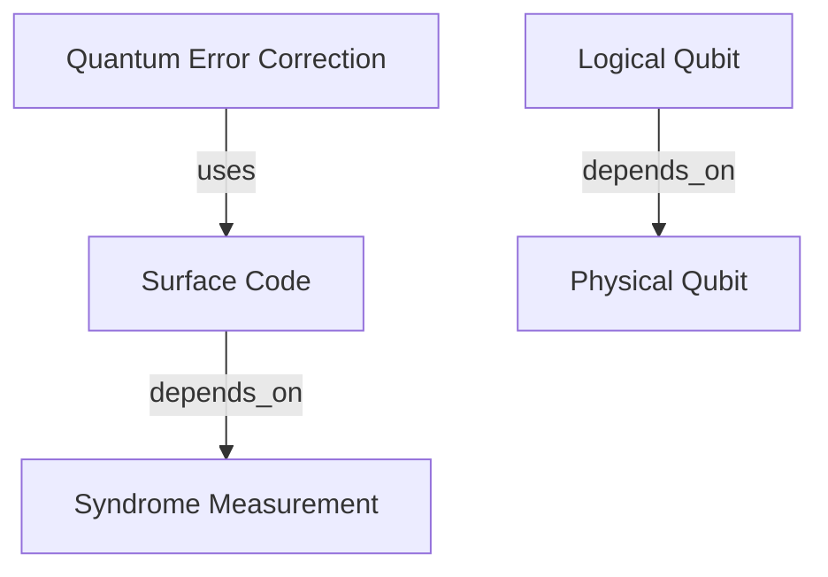

# PaperHunterAgent - QuantumResearchChain

A sophisticated multi-agent system designed to hunt, analyze, and map quantum science research papers. The system consists of three specialized agents that work together to provide comprehensive research insights.

## 🤖 Agents Overview

### 1. PaperHunterAgent
**Goal:** Find the most relevant and NEW quantum-science papers every day.

**Features:**
- Searches arXiv categories: `quant-ph`, `hep-th`, `cond-mat`, `cs.QC`
- Queries Semantic Scholar API for citation analysis
- Filters papers by keywords, language, and length
- Returns JSON formatted results with relevance scores

### 2. SummarizerAgent
**Mission:** Create concise but information-dense summaries of quantum science papers.

**Features:**
- PDF text extraction and processing (from URL or local file)
- LaTeX equation identification
- Technical term glossary generation
- Structured Markdown output format
- Critical assessment and contribution analysis

### 3. ConceptMapAgent
**Objective:** Transform summaries into machine-readable concept graphs.

**Features:**
- Entity extraction from research summaries
- Relationship mapping between concepts
- Mermaid diagram generation
- Quantum physics domain knowledge integration

## 🚀 Quick Start

### Prerequisites
```bash
pip install -r requirements.txt
```

### Basic Usage

```python
from src.paper_hunter_agent import PaperHunterAgent
from src.summarizer_agent import SummarizerAgent
from src.concept_map_agent import ConceptMapAgent

# Define your research interests
keywords = ["quantum error correction", "surface code", "logical qubit"]

# Initialize agents
hunter = PaperHunterAgent(user_keywords=keywords)
summarizer = SummarizerAgent()
mapper = ConceptMapAgent()

# Hunt for papers
papers_json = hunter.hunt_papers(max_papers=10)
papers = json.loads(papers_json)

# Summarize a paper
if papers:
    summary = summarizer.create_summary(papers[0])
    concept_map = mapper.create_concept_map(summary)
    print(concept_map)
```

### Run Demo
```bash
python main.py
```

## 📋 Output Formats

### PaperHunterAgent Output (JSON)
```json
[
  {
    "title": "Quantum Error Correction with Surface Codes",
    "authors": ["Last, F.", "Another, A."],
    "arxiv_id": "2401.00001",
    "doi": "10.1000/example or null",
    "published": "2024-01-15",
    "url_pdf": "https://arxiv.org/pdf/2401.00001.pdf",
    "abstract": "Abstract text...",
    "relevance_score": 85
  }
]
```

### SummarizerAgent Output (Markdown)
```markdown
# Paper Title

| Field | Value |
|-------|-------|
| Authors | Author1, Author2 |
| Published | 2024-01-15 |
| Primary Topic | Quantum Error Correction |
| Key Equations | Eq. 1: H = ..., Eq. 2: |ψ⟩ = ... |

## TL;DR (≤ 120 words)
Concise summary of the paper...

## Main Contributions
• First contribution
• Second contribution

## Critical Assessment
**Why it matters:** Explanation...
**Potential weaknesses:** Limitations...

## Glossary
| Term | Definition |
|------|------------|
| Qubit | Quantum bit |
```

### ConceptMapAgent Output (Mermaid)


## 🔧 Configuration

### Search Parameters
- **arXiv Categories:** `quant-ph`, `hep-th`, `cond-mat`, `cs.QC`
- **Time Windows:** Last 24h (expandable to ±7 days if <3 papers found)
- **Paper Limits:** 10 papers maximum output
- **Language Filter:** English only
- **Length Filter:** ≥6 pages (estimated)

### Filtering Rules
- Excludes duplicates by arXiv ID or DOI
- Must match at least one user-defined keyword
- Automatic relevance scoring (0-100)

## 🛠️ Advanced Usage

### Custom Keywords
```python
# Define domain-specific keywords
custom_keywords = [
    "quantum machine learning",
    "variational quantum eigensolvers", 
    "quantum approximate optimization",
    "quantum neural networks"
]

hunter = PaperHunterAgent(user_keywords=custom_keywords)
```

### Batch Processing
```python
# Process multiple papers
papers = json.loads(hunter.hunt_papers(max_papers=10))

summaries = []
concept_maps = []

for paper in papers:
    summary = summarizer.create_summary(paper)
    if "⚠️ Unable to parse PDF" not in summary:
        summaries.append(summary)
        concept_maps.append(mapper.create_concept_map(summary))
```

## 📊 API Integrations

### arXiv API
- Direct Python library integration
- Real-time paper discovery
- Metadata extraction

### Semantic Scholar API
- Citation network analysis
- Cross-reference discovery
- Enhanced paper relationships

## 🔍 Logging and Monitoring

The system includes comprehensive logging:
```python
import logging
logging.basicConfig(level=logging.INFO)
```

Logs are saved to `quantum_research.log` and include:
- Search progress and results
- PDF processing status
- Error handling and recovery
- Performance metrics

## 🚦 Error Handling

### Common Issues and Solutions

1. **PDF Parsing Failures**
   - Fallback from pdfplumber to PyPDF2
   - Graceful degradation with "⚠️ Unable to parse PDF" message

2. **API Rate Limits**
   - Built-in retry mechanisms
   - Respectful request spacing

3. **Network Timeouts**
   - 30-second PDF download timeout
   - Connection error recovery

## 📈 Performance Considerations

- **Batch Size:** Recommended max 10 papers per hunt
- **PDF Processing:** Can be slow for large documents
- **Memory Usage:** PDF content temporarily stored in memory
- **Network:** Requires stable internet for API calls

## 🤝 Contributing

1. Fork the repository
2. Create a feature branch
3. Add tests for new functionality
4. Follow the existing code style
5. Submit a pull request

## 📝 License

This project is open source. Please check the license file for details.

## 🔗 Related Resources

- [arXiv API Documentation](https://arxiv.org/help/api)
- [Semantic Scholar API](https://www.semanticscholar.org/product/api)
- [Mermaid Diagram Syntax](https://mermaid.js.org/)
- [Quantum Computing Papers](https://quantum-journal.org/)

## 📞 Support

For issues, questions, or contributions, please open an issue in the repository.

---

**Happy Quantum Research Hunting! 🔬⚛️**
