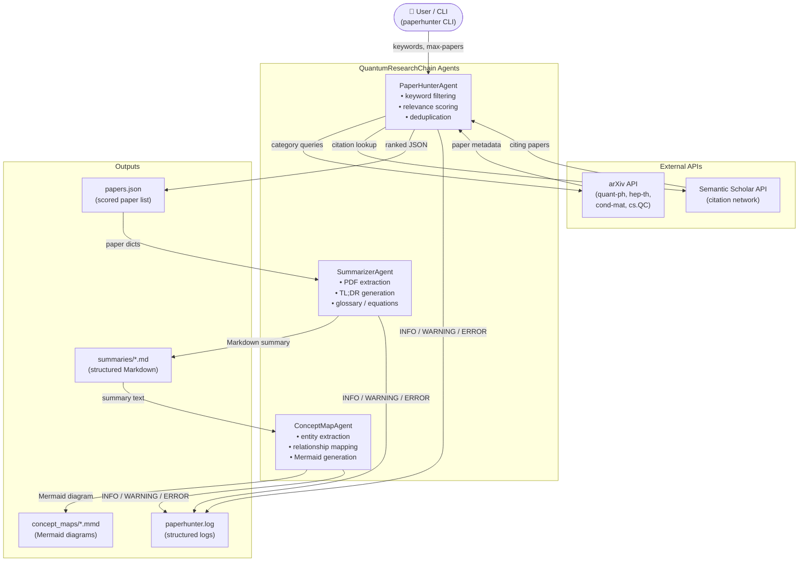

# Architecture — PaperHunterAgent

PaperHunterAgent is a **multi-agent pipeline** that chains three specialised agents to turn raw user keywords into structured research artefacts (JSON paper lists, Markdown summaries, and Mermaid concept maps).

---

## High-Level Architecture



---

## Key Design Decisions

### 1. Multi-agent separation of concerns
Each agent has a single responsibility: **hunt**, **summarize**, or **map**.  
This makes each component independently testable and replaceable — e.g. you can swap the summarisation logic without touching paper discovery.

### 2. Graceful degradation
- If a PDF cannot be downloaded or parsed, the `SummarizerAgent` falls back to the abstract text.  
- If the abstract is also missing, a clear `⚠️ Unable to parse PDF` sentinel is returned and the concept-map step is skipped — the pipeline never crashes.

### 3. Relevance scoring and deduplication
`PaperHunterAgent` assigns a 0–100 relevance score (keyword match in title + recency bonus) and deduplicates by arXiv ID and DOI, so downstream agents never see the same paper twice.

### 4. Adaptive search window
The agent first looks at the last 24 hours. If fewer than three papers are found (e.g. on weekends), it automatically expands to ±7 days — no user intervention required.

### 5. Structured logging
All three agents use Python's standard `logging` module with a shared format (`%(asctime)s - %(name)s - %(levelname)s - %(message)s`).  
Logs go to both stdout and a file, making the pipeline transparent and easy to debug in CI or on a server.

### 6. CLI-first, library-second
The `paperhunter` CLI (`src/cli.py`) is the primary interface. The underlying classes (`PaperHunterAgent`, `SummarizerAgent`, `ConceptMapAgent`) are also importable as a Python library for custom scripting.

### 7. No external LLM dependency
All summarisation and concept-map logic is implemented with regex, heuristics, and domain knowledge — no OpenAI / Anthropic API calls are required.  
This means the tool works fully offline (except for arXiv/Semantic Scholar fetching) and has no usage-based cost.

---

## Data Flow

```
User keywords
    │
    ▼
PaperHunterAgent.hunt_papers()
    ├─ search_arxiv_papers()     → raw arXiv results
    ├─ search_semantic_scholar() → enriched / citing papers
    ├─ filter_and_deduplicate()  → sorted by relevance_score
    └─ returns JSON string
    │
    ▼
SummarizerAgent.create_summary(paper_dict)
    ├─ extract_pdf_text()        → pdfplumber → PyPDF2 → abstract
    ├─ extract_equations()       → LaTeX patterns
    ├─ identify_primary_topic()  → domain keyword map
    ├─ generate_tldr()           → 120-word cap
    ├─ extract_contributions()   → regex contribution patterns
    ├─ extract_glossary_terms()  → quantum term definitions
    └─ returns Markdown string
    │
    ▼
ConceptMapAgent.create_concept_map(summary_text)
    ├─ extract_entities()        → quantum terms + capitalised phrases
    ├─ extract_relationships()   → regex + domain rules
    ├─ generate_mermaid_diagram()→ graph TD with node/edge limits
    └─ returns Mermaid string
```
